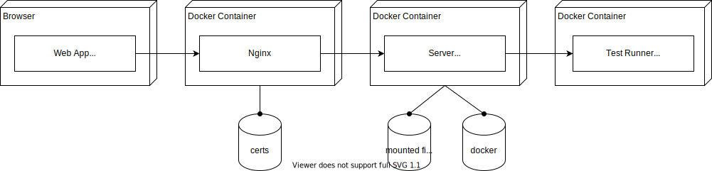

ITD-Challenge Platform - Arc 42 Documentation
========================

The Challenge platform enables the learning of new programming languages playfully. For this purpose, programming beginners as well as experts can choose one from a variety of task descriptions and solve it offline in a programming language of their choice. The source code can then be uploaded to the platform, where it is compiled, executed and automatically tested using isolated docker containers. In addition to immediate feedback on whether the submission was successful or which errors occurred, learners can receive feedback from experts on the quality of their successful submissions.

Tasks can be created and kept up-to-date by administrators & content creators. By default, tasks can be tested based on console input & output. In principle, however, it is also possible to create more complex test runners.

Group moderators have the possibility to give a selection of tasks to their group members and thus playfully accompany whole programming courses.

1 Introduction and Goals
---------------------

1.1 Requirements Overview

- Learners should enroll themselves in groups
- Learners should view challenges (including description, example program output, difficulty level, ...)
- Learners should use a programming language of their choose to solve the challenge
- Learners should receive feedback on whether their submission passes all automated tests, or if not, the reason for error
- Participants should receive a review of their submission to learn best programming practices from colleagues
- Teachers should administrate learning groups (define challenges to support the learning)
- Teachers should monitor the progress of their learners (including duplicate checks)
- Creators should define challenges and screen submissions for them
- Reviewers should evaluate submissions for their programming language expertise, but restricted to those challenges, they have solved by their own

1.2 Quality Goals

- It shall not be possible to use the platform without a user authentication
- It shall not be possible to escape the sandboxing there the code is executed
- It shall not be possible to bypass the learning group and role restrictions (whitelisting)
- It shall be possible to build & run the challenge platform via docker
- It shall make fun to learn programming languages :)

1.3 Stakeholders

- This project has been developed for internal education purposes for years to enable colleagues of any experience level to learn programming languages
- Most recent, also Universities integrated this platform into their programming courses to enable students to learn playfully and in their own speed
- Furthermore, the platform is used to support courses of all kinds

2 Architecture Constraints
---------------------

None noteworthy. The project shall be build and executed with Docker.
As an open source project, only third-party open source libraries may be used.

3 System Scope and Context
---------------------

The platform should only be used for learning purposes.
Therefore, the business value derives completely from trained colleagues and there shall be no measurement of the “learning success” or “business value” of colleagues.
In consequence, we can focus ourselves purely on technical details.

> The context diagram visualizes the requirements already stated in 1.1 Requirements Overview.
> Therefore, no additional explanation is provided.

4 Solution Strategy
---------------------

The solution strategy is to compile and execute source code by the most recent programming language compilers and runtimes.
To get things more robust, Docker is used to isolate each submission evaluation and to achieve a high portability of the dotnet core project.
For increased usability, a frontend is provided to manage among others challenges, groups and reviews.

5 Building Block View
---------------------

**5.1 Whitebox Overall System**

Although the true whitebox system view would only consist of the SubmissionEvaluation.Server component, as it is the only executable and delivers the frontend, also the SubmissionEvaluation.Client is shown next.
The Client code is written as a single Blazor WebAssembly app, which is provided to all stakeholders. As such, all views can be accessed by everyone & the data security has to be purely managed by the Server component.
The interface between those two components is simply realized as REST-API.

**5.2 Blackbox System - Level 1**

As the whitebox view already reveals all systems, does the next level already show central libraries.
Basically, there is a centrally shared library “Contracts”. Despite its name, does it contain not only common interfaces but also common entities.
On top, are several helper libraries to separate individual functionalities like the domain logic, common UI elements, compiler adapters and several providers to integrate ldap/mail/....

6 Runtime View
---------------------

> Not provided as it would not provide useful information

7 Deployment View
---------------------

The deployment view is quite simple as the hole system is basically a single server application.
Therefore, only the components mentioned in the whitebox building block view are assigned to their deployment environment.

8 Cross-cutting Concepts
---------------------

> None

9 Design Decisions
---------------------

> None

10 Quality Requirements
---------------------

There are only those quality requirements as stated in “1.2 Quality Goals” and in [requirements.md](./requirements.md)

11 Risks and Technical Debts
---------------------

> None

<!-- styling section -->

